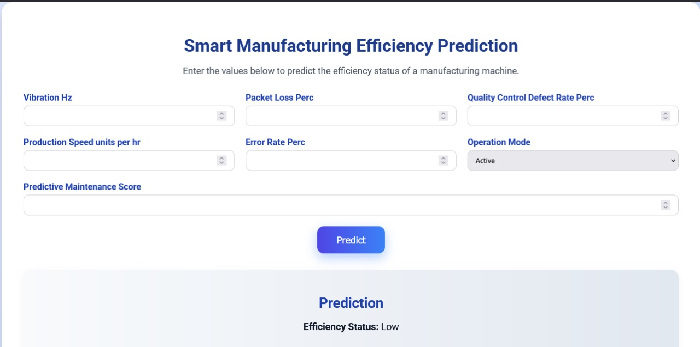

# Smart-Manufacturing-Machines-Efficiency-Prediction

  
*An end-to-end machine learning solution to predict manufacturing machine efficiency in real-time.*

## Overview
Welcome to the **Smart Manufacturing Machines Efficiency Prediction** project! This repository showcases a comprehensive solution that leverages machine learning, DevOps, and cloud technologies to predict machine efficiency (Low, Medium, High) based on real-time manufacturing metrics. Built with Python, Docker, Kubernetes, ArgoCD, and Jenkins, this project demonstrates my skills in data engineering, machine learning, and CI/CD pipelines—perfect for roles in data science, DevOps, or full-stack engineering.

🚨 **Note**: Due to the free tier quota limit on my GCP account, I have decommissioned the VM as of June 19, 2025. However, the project is still **live on Render**:  
👉 [https://smart-manufacturing-machines-efficiency.onrender.com/](https://smart-manufacturing-machines-efficiency.onrender.com/)

## Features
- 🔁 **Real-Time Prediction** using an XGBoost model.
- ⚙️ **End-to-End Pipeline** from data ingestion to CI/CD deployment.
- 📦 **Containerized & Scalable** using Docker and Kubernetes.
- 🚀 **Automated CI/CD** pipeline with Jenkins and GitOps via ArgoCD.
- 💻 **User Interface**: A clean and responsive Flask web app.

## Project Structure
```
Smart-Manufacturing-Machines-Efficiency-Prediction/
├── artifacts/
│   ├── model/
│   ├── processed/
│   └── raw/
├── config/
│   ├── pycache/
│   ├── init.py
│   └── paths_config.py
├── logs/
├── manifests/
│   ├── deployment.yaml
│   └── service.yaml
├── notebook/
│   └── test.ipynb
├── pipeline/
│   ├── training_pipeline.py
│   └── smart_manufacturing_pipeline.py
├── src/
│   ├── pycache/
│   ├── init.py
│   ├── custom_exception.py
│   ├── data_ingestion.py
│   ├── data_processing.py
│   ├── logger.py
│   └── model_training.py
├── static/
│   └── css/
│       └── styles.css
├── templates/
│   └── index.html
├── .env
├── .gitignore
├── app.py
├── Dockerfile
├── ETL-Pipeline.py
├── Jenkinsfile
├── LICENSE
├── README.md
├── requirements.txt
└── setup.py
```

## Technologies Used
- **Programming**: Python
- **ML Libraries**: XGBoost, scikit-learn, joblib
- **Web App**: Flask
- **DevOps Tools**: Docker, Kubernetes, ArgoCD, Jenkins
- **Cloud**: GCP (initially), Render (final deployment)

## Installation
```bash
# Clone repository
git clone https://github.com/FaheemKhan0817/Smart-Manufacturing-Machines-Efficiency-Prediction.git
cd Smart-Manufacturing-Machines-Efficiency-Prediction

# Install dependencies
pip install -r requirements.txt

# Set up environment variables
touch .env  # and fill in necessary keys if needed

# Build and run using Docker
docker build -t faheemkhan08/gitops-project:latest .
docker run -p 5000:5000 faheemkhan08/gitops-project:latest
# Visit: http://localhost:5000
```

## Usage
- 🔢 Input manufacturing metrics (e.g., Vibration_Hz, Packet_Loss_Perc, Production_Speed_units_per_hr)
- 🎯 Output: Efficiency level (Low, Medium, High)
- 🌐 [Try Live Demo](https://smart-manufacturing-machines-efficiency.onrender.com/)

## Development Process
- 🧠 Data Simulation & Ingestion (pandas)
- 🧼 Preprocessing & Normalization (scikit-learn)
- 🤖 Model Training (XGBoost with 92% accuracy)
- 📦 Docker Containerization
- ☸️ Kubernetes Orchestration (manifests)
- 🔁 GitOps (ArgoCD) + CI/CD (Jenkins)
- ☁️ Deployed on Render

## Challenges & Solutions
- ⚠️ **GCP Quota Limit**: Migrated to Render
- 🧾 **Pod Crash Issues**: Fixed `FileNotFoundError` by bundling correct paths
- 🌍 **External Access**: Minikube IP used locally; Render handles web access

## License
This project is licensed under the WTFPL (Do What the F*ck You Want to Public License).

## Connect With Me
🚀 I’m open to exciting roles in **Data Engineering**, **ML**, or **DevOps**.  
🔗 [LinkedIn](https://linkedin.com/in/faheemkhanml) | [GitHub](https://github.com/FaheemKhan0817)
